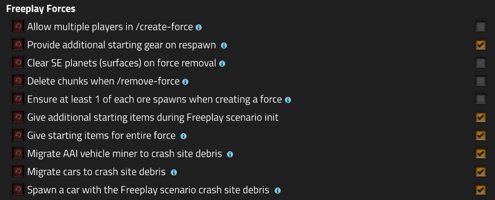

# Freeplay Forces

Adds a command interface / startup options that enhance Freeplay scenario allowing players to have their own force, and start separately from the main spawn. If Space Exploration is installed, it use what is available in the `remote.interfaces[\"space-exploration\"]`.

Use `/ff-commands` in-game to see all of the commands that this mod adds.

There are many features built into startup settings as well:

This mod also includes functionality from my other mod, [Head Start](https://mods.factorio.com/mod/head-start).

[Download the mod here](https://mods.factorio.com/mod/freeplay-forces)